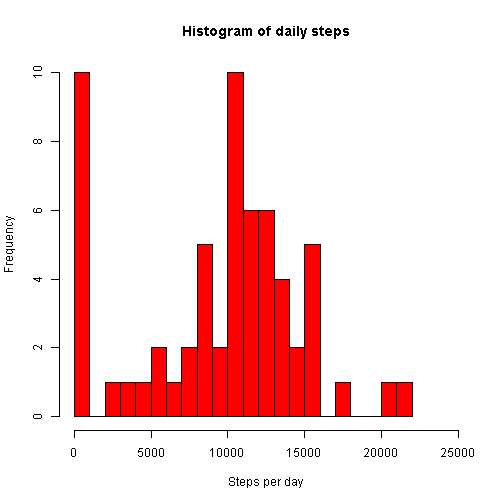
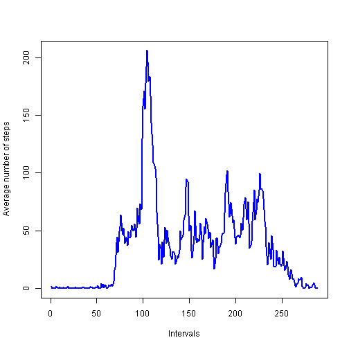
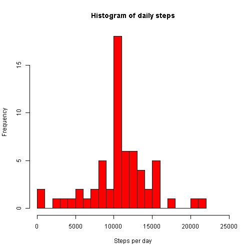
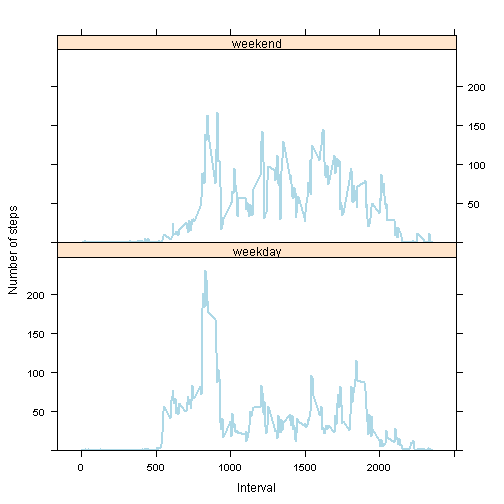

## Loading and preprocessing the data

```r
data <- read.csv(unzip("activity.zip"))
```


## What is mean total number of steps taken per day?

```r
ds = tapply(data$steps, data$date, sum, na.rm = TRUE )
hist( ds
    , col = "red"
    , main = "Histogram of daily steps"
    , xlab = "Steps per day"
    , breaks = 25
    , xlim = c(0, 25000)
    )
```

 

```r
mean(ds)
```

```
## [1] 9354.23
```

```r
median(ds)
```

```
## [1] 10395
```


## What is the average daily activity pattern?

```r
is = tapply(data$steps, data$interval, mean, na.rm = TRUE )
plot( is
    , col = "blue"
    , main = ""
    , xlab = "Intervals"
    , ylab = "Average number of steps"
    , type = "l"
    , lwd = 2
    )
```

 

```r
# The maximum value is:
max(is)
```

```
## [1] 206.1698
```

```r
# The first value is the starting time of the interval in a given day, the second is the index of the interval 
which.max(is)
```

```
## 835 
## 104
```

```r
# To doublecheck:
is[104]
```

```
##      835 
## 206.1698
```


## Imputing missing values

```r
# Total number of rows with NA
length(data$step[is.na(data$step)])
```

```
## [1] 2304
```

```r
# Replacing NAs with the overall mean steps by respective intervals.
cond = is.na(data$step)
i = data$interval[cond]
data$steps[cond] = is[as.character(i)]
ds = tapply(data$steps, data$date, sum, na.rm = TRUE )
hist( ds
    , col = "red"
    , main = "Histogram of daily steps"
    , xlab = "Steps per day"
    , breaks = 25
    , xlim = c(0, 25000)
    )
```

 

```r
mean(ds)
```

```
## [1] 10766.19
```

```r
median(ds)
```

```
## [1] 10766.19
```

## Are there differences in activity patterns between weekdays and weekends?


```r
# Creating a new factor variable and setting the values based on the date
wd <- c("Mon","Tue", "Wed", "Thu", "Fri")
we <- c("Sat","Sun")
data$day  <-  factor (c("weekday", "weekend"))
data$day[weekdays(strptime(data$date,"%Y-%m-%d"), abbreviate = TRUE) %in% wd] <- "weekday"
data$day[weekdays(strptime(data$date,"%Y-%m-%d"), abbreviate = TRUE) %in% we] <- "weekend"
```


```r
xyplot( data$steps ~ data$interval | data$day
      , xlab = "Interval"
      , ylab = "Number of steps"
      , layout = c(1:2)
      , ylim = 0:max(is)*1.2
      , panel = function(x, y, ...) {
                panel.average( x, y
                             , type="l"
                             , col="lightblue"
                             , lwd=2
                             , horizontal = FALSE
                             , ...
                             )
                }
      )
```

 
